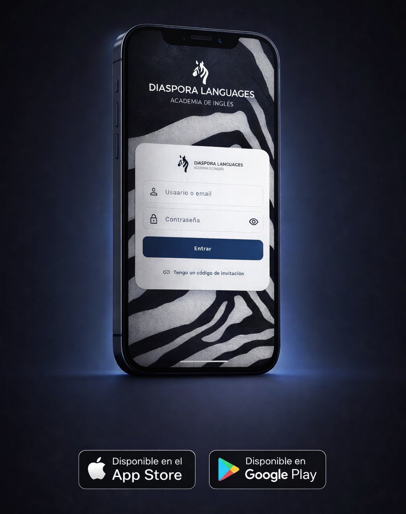
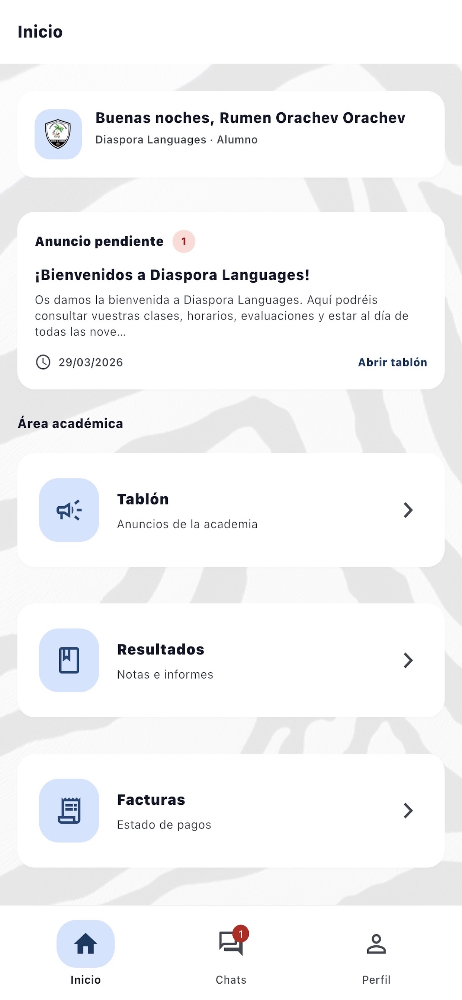
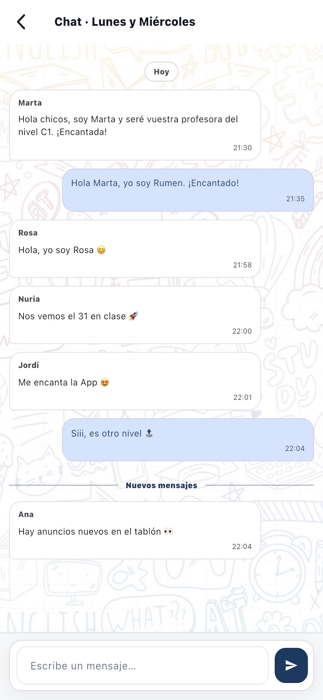
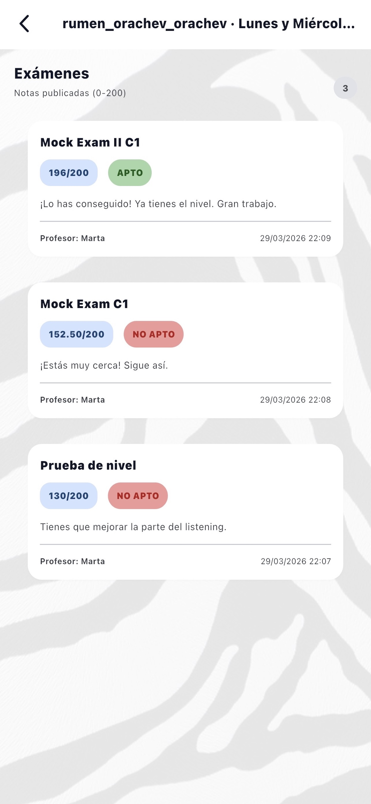

# 📱 Diaspora Languages

Plataforma SaaS de gestión académica para academias de idiomas, actualmente implantada en un entorno real y disponible en App Store y Google Play.

---

## 🚀 Sobre el proyecto

Diaspora Languages es una aplicación móvil desarrollada como Trabajo de Fin de Grado que ha evolucionado hasta convertirse en una solución real utilizada en una academia de idiomas.

El sistema permite gestionar de forma centralizada la actividad académica diaria, ofreciendo herramientas tanto para alumnado como profesorado y administración.

---

## 🧩 Funcionalidades principales

- 📊 Inicio personalizado por rol (alumno, profesor, administración)
- 📢 Tablón de anuncios
- 💬 Chat de clase en tiempo real
- 📝 Gestión de exámenes y resultados
- 🧾 Sistema de facturación
- 🎟️ Registro mediante invitaciones
- 🔐 Autenticación segura y control de acceso

---

## 🛠️ Tecnologías utilizadas

- **Frontend móvil:** Flutter (Dart)
- **Backend:** Django REST Framework (Python)
- **Base de datos:** PostgreSQL
- **Infraestructura:** Hetzner + Cloudflare
- **Publicación:** App Store y Google Play

---

## 🏗️ Arquitectura

Aplicación basada en arquitectura cliente-servidor:

- App móvil desarrollada en Flutter
- API REST construida con Django
- Base de datos PostgreSQL en servidor remoto
- Proxy y seguridad gestionados mediante Cloudflare

---

## 📲 Descarga

- 🍎 App Store  
https://apps.apple.com/es/app/diaspora-languages/id6760665894  

- 🤖 Google Play  
https://play.google.com/store/apps/details?id=es.rumenorachev.diaspora&hl=es  

---

## 🧪 Clase de muestra

Puedes probar la aplicación accediendo a una clase demo:

🔗 https://api.rumenorachev.es/invite/zh4rwTOhIOtJp128k9WbPA/

Para completar el registro, utiliza el siguiente DNI de prueba:

12345678A

Una vez dentro, puedes explorar la aplicación y utilizar el chat.

---

## 📸 Capturas

### 📱 Vista general

  

---

### 🏠 Dashboard

  

---

### 💬 Chat de clase

  

---

### 📝 Exámenes y resultados

  

---

## 🔒 Nota sobre el código

El código fuente completo del proyecto no se publica de forma íntegra por incluir lógica de negocio real, configuración de despliegue y elementos internos del sistema actualmente en uso.

Este repositorio tiene como objetivo mostrar el funcionamiento, arquitectura y acceso a la aplicación.

---

## 🌐 Más información

- Portfolio: https://www.rumenorachev.es  
- LinkedIn: https://www.linkedin.com/in/rumenorachev/

---

## 📌 Estado del proyecto

✅ Aplicación en producción  
✅ Usuarios reales activos  
✅ Publicada en tiendas móviles  

---

## ✨ Autor

**Rumen Orachev Orachev**  
