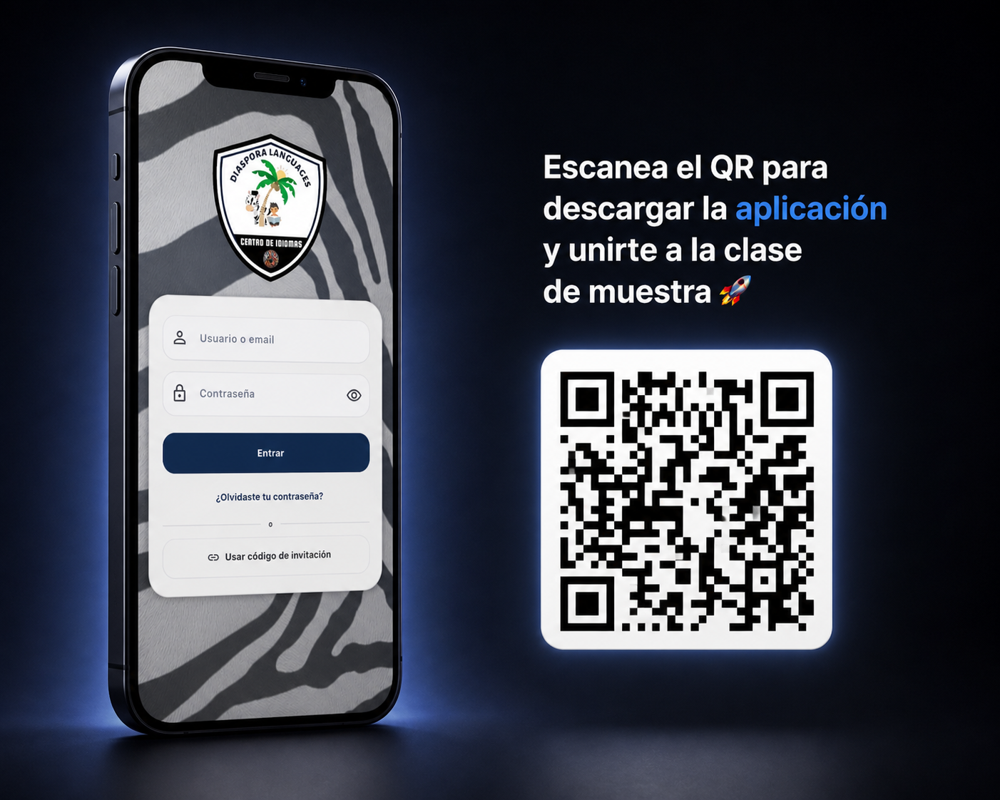
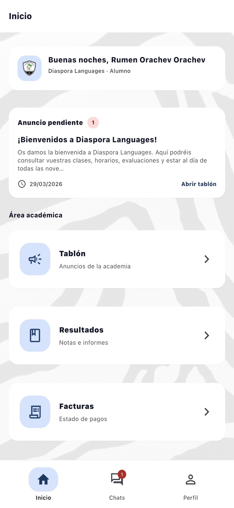
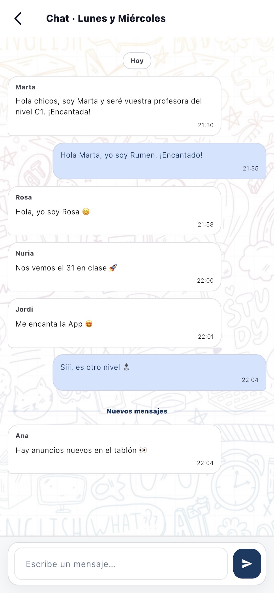
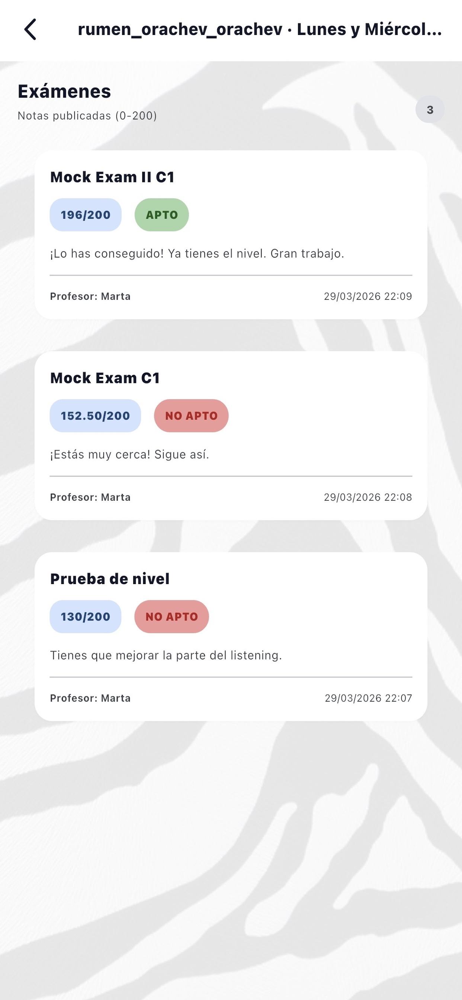

# 📱 Diaspora Languages

Plataforma SaaS de gestión académica para academias de idiomas, actualmente implantada en un entorno real, con usuarios activos y disponible en App Store y Google Play.

---

## 🚀 Sobre el proyecto

Diaspora Languages es una aplicación móvil desarrollada inicialmente como Trabajo de Fin de Grado que ha evolucionado hasta convertirse en una solución real utilizada en una academia de idiomas.

El objetivo del proyecto es centralizar y simplificar la gestión académica diaria, mejorando la comunicación entre alumnado, profesorado y administración mediante una experiencia móvil unificada.

---

## 🧩 Funcionalidades principales

- 📊 Inicio personalizado según el rol de usuario
- 📢 Tablón de anuncios
- 💬 Chat de clase en tiempo real
- 📝 Gestión de exámenes, resultados e informes
- 🧾 Sistema de facturación y consulta de recibos
- 🎟️ Registro mediante invitaciones
- 👥 Administración de usuarios, clases y profesorado
- 👨‍🎓 Consulta del alumnado asociado a cada clase
- 📅 Calendario académico integrado
- 🔔 Notificaciones push
- ⚙️ Gestión de perfil y credenciales
- 🔐 Autenticación segura y control de acceso

---

## 🛠️ Tecnologías utilizadas

- **Frontend móvil:** Flutter (Dart)
- **Backend:** Django REST Framework (Python)
- **Base de datos:** PostgreSQL
- **Infraestructura:** Hetzner + Cloudflare
- **Publicación:** App Store y Google Play

---

## 🏗️ Arquitectura

Aplicación basada en arquitectura cliente-servidor:

- App móvil desarrollada en Flutter
- API REST construida con Django
- Base de datos PostgreSQL alojada en servidor remoto
- Proxy, seguridad y exposición pública gestionados mediante Cloudflare

---

## 📌 Estado del proyecto

✅ Aplicación en producción  
✅ Usuarios reales activos  
✅ Publicada en App Store  
✅ Publicada en Google Play  

---

## 📲 Descarga

- 🍎 App Store  
https://apps.apple.com/es/app/diaspora-languages/id6760665894  

- 🤖 Google Play  
https://play.google.com/store/apps/details?id=es.rumenorachev.diaspora&hl=es  

---

## 🧪 Clase de muestra

Puedes probar una clase demo accediendo al siguiente enlace:

🔗 https://api.rumenorachev.es/invite/zh4rwTOhIOtJp128k9WbPA/

Para completar el registro, utiliza el siguiente DNI de prueba:

`12345678A`

Una vez dentro, podrás explorar la aplicación y utilizar el chat.

> Nota: El acceso demo está pensado únicamente para mostrar el funcionamiento general de la plataforma. No incluye lógica interna, configuración privada ni datos sensibles del entorno real.

---

## 📸 Capturas

### 📱 Mockup

  

---

### 🏠 Dashboard

  

---

### 💬 Chat de clase

  

---

### 📝 Exámenes y resultados

  

---

## 🔒 Nota sobre el código

El código fuente completo del proyecto no se publica de forma íntegra por incluir lógica de negocio real, configuración de despliegue, integraciones y componentes internos actualmente en uso.

Este repositorio tiene como objetivo mostrar el funcionamiento, arquitectura y alcance general de la plataforma.

---

## ✨ Valor del proyecto

Diaspora Languages no es únicamente una demo académica, sino una aplicación real desplegada y utilizada en un entorno operativo.

El proyecto refleja experiencia práctica en:

- 📱 Desarrollo móvil multiplataforma con Flutter
- ⚙️ Diseño y construcción de APIs REST
- ☁️ Despliegue y operación de infraestructura cloud
- 🏗️ Arquitectura cliente-servidor
- 📚 Modelado de procesos académicos reales
- 🚀 Gestión completa del ciclo de vida de una aplicación

---

## 🌐 Más información

- Portfolio: https://www.rumenorachev.es  
- LinkedIn: https://www.linkedin.com/in/rumenorachev/

---

## ✨ Autor

**Rumen Orachev Orachev**
