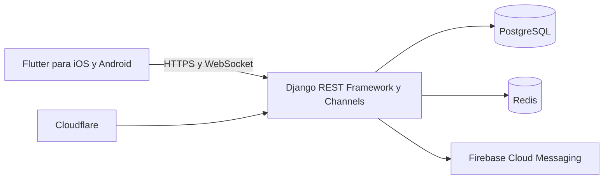
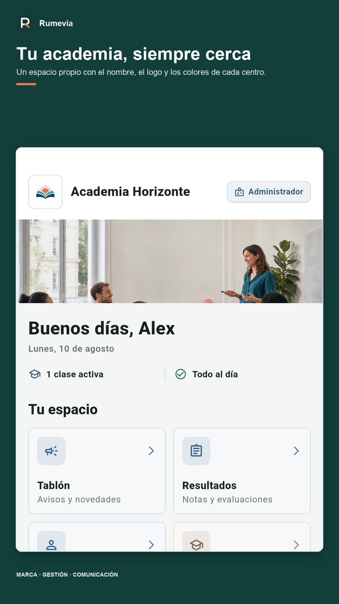
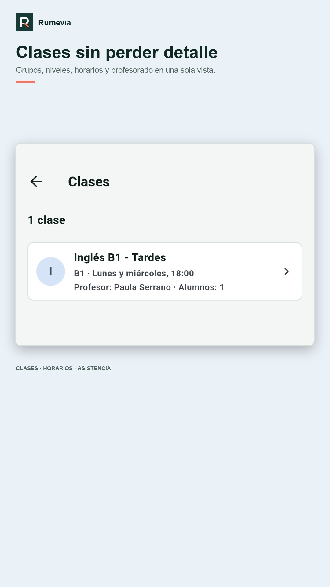
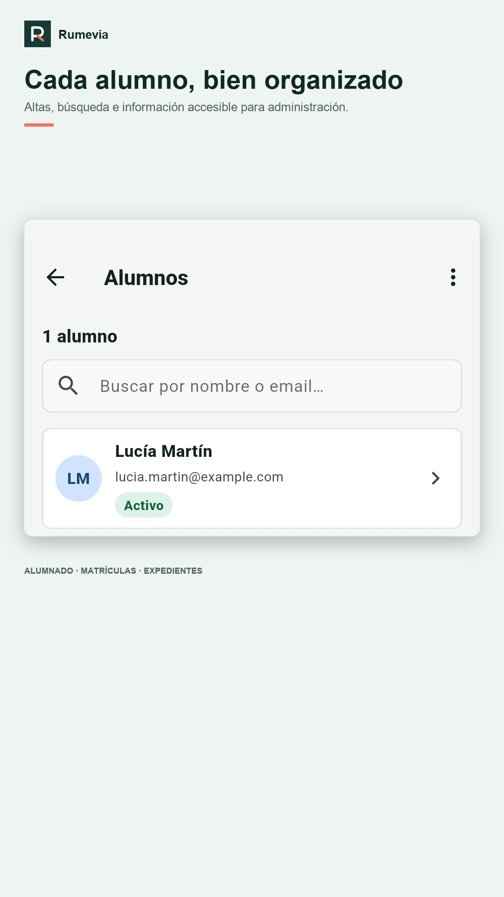
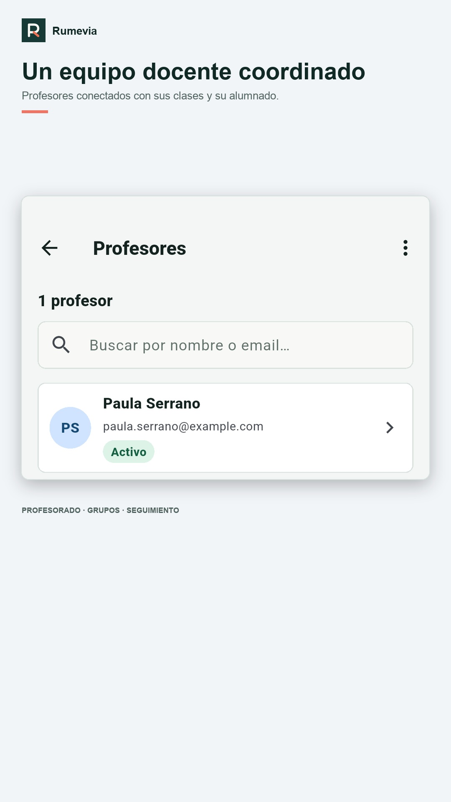
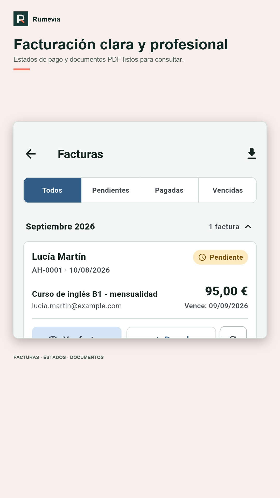
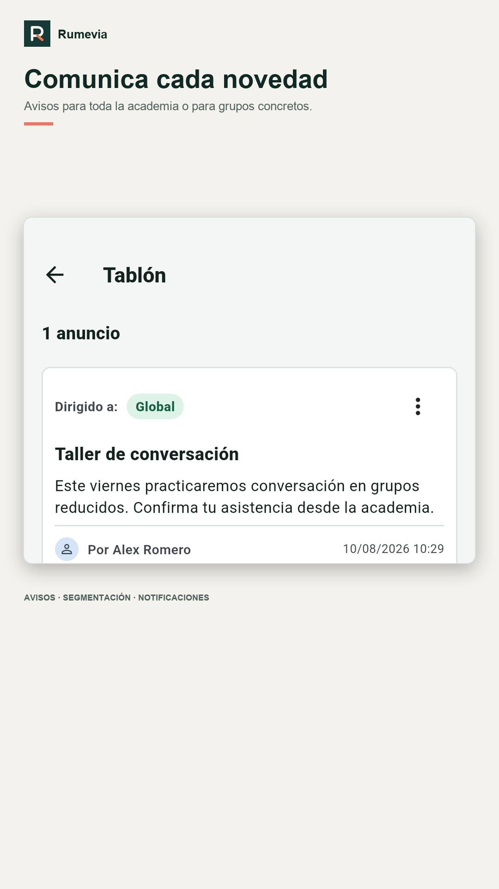

  

<h1 align="center">Rumevia</h1>

  <strong>Plataforma SaaS multiacademia para centralizar la gestión académica, la comunicación y la facturación.</strong>

  <a href="https://rumevia.com/">Sitio web</a> ·
  <a href="https://rumevia.com/support/">Soporte</a> ·
  <a href="https://rumevia.com/legal/privacy/">Privacidad</a> ·
  <a href="mailto:ventas@rumevia.com">Contacto comercial</a>

## El producto

Rumevia es un servicio B2B para academias y centros educativos. Una única
aplicación conecta a administración, profesorado y alumnado, mientras cada
academia conserva un espacio independiente con sus propios usuarios, datos,
permisos, clases y configuración visual.

Al iniciar sesión, Rumevia identifica automáticamente la academia del usuario
y aplica su nombre, logo, colores y datos de contacto. Esto permite operar
varios centros desde la misma plataforma sin crear una aplicación distinta para
cada cliente.

## Funciones principales

- Gestión de clases, grupos, horarios y matrículas.
- Control e historial de asistencia.
- Avisos generales o dirigidos por clase.
- Chat privado por clase con bloqueo, denuncia y moderación.
- Evaluaciones, resultados, comentarios y documentos.
- Facturas, vencimientos y estados de pago.
- Invitaciones y alta guiada de estudiantes.
- Importación y exportación CSV para administración.
- Personalización de logo, imagen, colores, contacto y documentos legales.
- Fotos de perfil, sesiones activas y eliminación de cuenta.
- Notificaciones push y actividad en tiempo real.

## Experiencia por rol

| Rol | Capacidades principales |
| --- | --- |
| Administrador | Configura la academia, gestiona personas y clases, publica avisos, emite facturas y modera comunicaciones. |
| Profesor | Consulta sus grupos, pasa asistencia, publica avisos, registra evaluaciones y participa en el chat. |
| Estudiante | Consulta clases, asistencia, avisos, evaluaciones, facturas y chats habilitados por su academia. |

## Arquitectura

```mermaid
flowchart LR
    A[Flutter para iOS y Android] -->|HTTPS y WebSocket| B[Django REST Framework y Channels]
    B --> C[(PostgreSQL)]
    B --> D[(Redis)]
    B --> E[Firebase Cloud Messaging]
    F[Cloudflare] --> B
```

- **Aplicación móvil:** Flutter y Dart.
- **Backend:** Django, Django REST Framework, ASGI y Channels.
- **Datos:** PostgreSQL con aislamiento lógico por academia.
- **Tiempo real:** WebSocket y Redis.
- **Infraestructura:** Hetzner, Nginx y Cloudflare.
- **Operaciones:** Sentry, Firebase Crashlytics, comprobaciones de salud y copias de seguridad.
- **Facturación SaaS:** Stripe Billing con suscripciones por academia.

## Modelo multiacademia

La transformación de Rumevia no consiste solo en duplicar datos. El tenant se
resuelve en el backend y se aplica en modelos, consultas, permisos y endpoints.
Los recursos académicos pertenecen a una academia concreta y el acceso depende
de una membresía con rol. El frontend recibe la configuración de marca del
tenant después de autenticarse y adapta la experiencia de forma dinámica.

## Capturas

<table>
  <tr>
    <td></td>
    <td></td>
    <td></td>
  </tr>
  <tr>
    <td align="center"><strong>Inicio</strong></td>
    <td align="center"><strong>Clases</strong></td>
    <td align="center"><strong>Alumnado</strong></td>
  </tr>
  <tr>
    <td></td>
    <td></td>
    <td></td>
  </tr>
  <tr>
    <td align="center"><strong>Profesorado</strong></td>
    <td align="center"><strong>Facturas</strong></td>
    <td align="center"><strong>Tablón</strong></td>
  </tr>
</table>

## Distribución

- **Android:** [Google Play](https://play.google.com/store/apps/details?id=es.rumenorachev.diaspora&hl=es)
- **iOS:** reconsideración solicitada a App Review para la versión pública.

Rumevia 2.0.0 ha sido validada en dispositivos físicos y en los canales internos
de ambas tiendas. El lanzamiento de Android ha superado la revisión de Google
Play; la publicación se mantiene bajo control manual.

## Evolución

Rumevia nace de la evolución de Diaspora Languages, un proyecto inicialmente
creado para una sola academia. La plataforma se ha rediseñado como producto
multi-tenant para que academias independientes puedan utilizar la misma base
técnica con datos, permisos y marca propios.

## Alcance de este repositorio

Este repositorio es un escaparate público del producto. El código fuente de la
aplicación, la configuración de producción, las integraciones privadas y la
lógica comercial se mantienen en un repositorio privado. Aquí no se publican
credenciales, datos de clientes ni configuración operativa sensible.

## Enlaces

- Producto: [rumevia.com](https://rumevia.com/)
- Soporte: [rumevia.com/support](https://rumevia.com/support/)
- Privacidad: [rumevia.com/legal/privacy](https://rumevia.com/legal/privacy/)
- Eliminación de cuenta: [rumevia.com/account-deletion](https://rumevia.com/account-deletion/)
- Portfolio: [rumenorachev.es](https://www.rumenorachev.es/)
- LinkedIn: [Rumen Orachev](https://www.linkedin.com/in/rumenorachev/)

## Autor

**Rumen Orachev Orachev**
